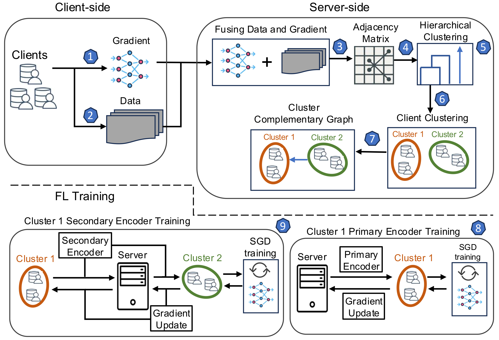

# FedDAG: Clustered Federated Learning via Global Data and Gradient Integration for Heterogeneous Environments

This repository includes the implementation of the FedDAG framework, presented at ICLR 2026.

**Paper:** "[FedDAG: Clustered Federated Learning via Global Data and Gradient Integration for Heterogeneous Environments](https://iclr.cc/virtual/2026/poster/10008332)"

<b>NOTICE:</b> This is an academic proof-of-concept prototype and has not received careful code review. This implementation is NOT ready for production use.



### Abstract

Federated Learning (FL) enables a group of clients to collaboratively train a model without sharing individual data, but its performance drops when client data are heterogeneous. Clustered FL tackles this by grouping similar clients. However, existing clustered FL approaches rely solely on either data similarity or gradient similarity; however, this results in an incomplete assessment of client similarities. Prior clustered FL approaches also restrict knowledge and representation sharing to clients within the same cluster. This prevents cluster models from benefiting from the diverse client population across clusters. To address these limitations, FedDAG introduces a clustered FL framework that employs a weighted, class-wise similarity metric that integrates both data and gradient information, providing a more holistic measure of similarity during clustering. In addition, FedDAG adopts a dual-encoder architecture for cluster models, comprising a primary encoder trained on its own clients' data and a secondary encoder refined using gradients from complementary clusters. This enables cross-cluster feature transfer while preserving cluster-specific specialization. Experiments on diverse benchmarks and data heterogeneity settings show that FedDAG consistently outperforms state-of-the-art clustered FL baselines in accuracy.

### Dependencies
To run FedDAG, one needs to install:
* Python 3.9+
* PyTorch (2.9.1 has been used for testing)
* torchvision 0.24.1
* NumPy, SciPy, scikit-learn, Pillow, tqdm, matplotlib

Install all dependencies at once:
```
pip install -r Code/requirements.txt
```

### Setup

#### Data Preparation
Datasets (CIFAR-10, CIFAR-100, MNIST, Fashion-MNIST) are downloaded automatically via torchvision on the first run and stored in `../data/` by default. Use the `--datadir` flag to specify a custom path.

For TinyImageNet, download the dataset manually and place the extracted folder at the path specified by `--datadir`.

#### To run FedDAG
Navigate to the `Code/` directory and execute:
```
python JN_main_feddag.py --dataset cifar10 --rounds 201 --frac 0.2 --beta 1 --gpu 0
```

CIFAR-10 with Dirichlet non-IID partitioning (β=0.5):
```
python JN_main_feddag.py --dataset cifar10 --partition noniid-labeldir --beta 0.5 --rounds 201 --num_users 100 --frac 0.2 --gpu 0
```

CIFAR-100:
```
python JN_main_feddag.py --dataset cifar100 --model simple-cnn-3 --partition noniid-labeldir --beta 0.5 --rounds 201 --num_users 100 --frac 0.2 --gpu 0
```

MNIST / Fashion-MNIST:
```
python JN_main_feddag.py --dataset fmnist --partition noniid-labeldir --beta 0.5 --rounds 201 --num_users 100 --frac 0.2 --gpu 0
```

One can also run the Jupyter notebook version by opening `Code/JN_main_feddag.ipynb`.

### Parameters

| Parameter | Description |
|---|---|
| `--rounds` | Number of communication rounds. |
| `--num_users` | Number of clients. |
| `--frac` | Fraction of clients sampled per round. |
| `--local_ep` | Number of local training epochs. |
| `--local_bs` | Local batch size. |
| `--lr` | Learning rate for local models. |
| `--momentum` | SGD momentum. |
| `--dataset` | Dataset: `mnist`, `fmnist`, `cifar10`, `cifar100`, `tinyimagenet`. |
| `--model` | Model architecture: `simple-cnn`, `simple-cnn-3`, `resnet9`. |
| `--partition` | Data partitioning: `homo`, `noniid-labeldir`, `noniid-#label1` (or 2, 3, …). |
| `--beta` | Dirichlet concentration parameter for heterogeneous partitioning. |
| `--cluster_alpha` | Distance threshold for hierarchical clustering. |
| `--n_basis` | Number of SVD basis vectors per class per client. |
| `--linkage` | Linkage type for hierarchical clustering (`average`, `minimum`). |
| `--datadir` | Path to datasets. |
| `--logdir` | Path to store logs. |
| `--gpu` | GPU ID to use; -1 for CPU. |
| `--print_freq` | Frequency (in rounds) for printing training statistics. |

### Contact
If you have any questions, please feel free to contact us at ap2645@njit.edu
